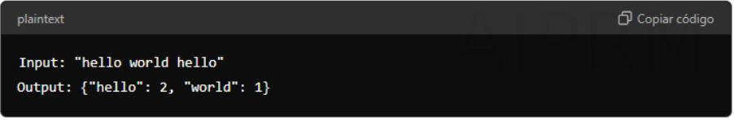

# Word counter

# Description

**Word Frequency Counter**

**Description**

Develop a program that counts the frequency of each word in a given text.

**Requirements**

- The program should take a string of text as input.

- It should return a dictionary with words as keys and their frequencies as values.

**Example**

**Libraries and Tools**

Collections module for Counter.

**Topics to Study**

- String methods

- Collections module

- Dictionary data structure

**Methodological Steps**

**Read the text:** Use input() or read from a file.
**Normalize the text:** Convert to lowercase and remove punctuation.
**Split into words:** Use split() to break the text into words.
**Count frequencies:** Use Counter from the collections module.
**Display results:** Print the word frequencies.

**Best Practices**

**Use libraries:** Leverage Counter for simplicity and efficiency.
**Normalize text:** Ensure consistent results by handling case and punctuation.
**Handle large inputs:** Be mindful of memory usage with large texts.

# Project
This project calculate how many times a word is repeted in a word

# Architecture

The "collections" library is imported to use the "counter" method (we will use it later). The user is asked to enter a phrase and it is saved in a variable, the string is converted into a list and the "counter" method is used to check how many times each word is repeated in the passed phrase and the number of times each word is repeated is returned

# Collections module:

1. namedtuple

**Description:**
Creates tuple-like classes with named fields, allowing access by name instead of index.

**Example:**

"""python
from collections import namedtuple

Point = namedtuple('Point', ['x', 'y'])
p = Point(10, 20)
print(p.x, p.y)  # Output: 10 20
"""